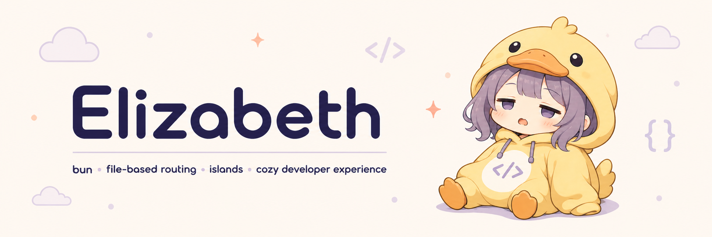

<kbd>
  
</kbd>

# Elizabeth

Elizabeth is a Bun full-stack web framework with `.liz` components, server rendering, file routes, API routes, scoped styles, CSS modules, client islands, and automatic layout transition.

This is an early `0.0.x` release. Expect rough edges while the syntax and runtime settle.

## Create An App

```bash
bun create elizabeth-app my-app
cd my-app
bun run dev
```

The dev server starts on port `3712` by default.

## Component Syntax

```tsx
@default
<HomePage>
  const items = [
    { text: "Fast" },
    { text: "Server first" },
    { text: "Scoped styles" },
  ];

  <style>
    .hero {
      padding: 32px;
      border: 1px solid rgba(0, 0, 0, .12);
      border-radius: 8px;
    }
  </style>

  <main className="hero">
    <h1>Elizabeth</h1>
    <ul>
      {
        for (const item of items) {
          <li>{item.text}</li>
        }
      }
    </ul>
  </main>
</HomePage>
```

`{...}` inside markup is JavaScript. To render text that looks like template syntax, use a string expression.

## Routes

Pages live in `src/pages` by default:

```text
src/pages/index.liz       -> /
src/pages/about.liz       -> /about
src/pages/users/[id].liz  -> /users/:id
src/pages/404.liz         -> custom 404
```

API routes live in `src/api` by default:

```ts
export function GET() {
  return Response.json({ message: "Hello from Elizabeth" });
}
```

`.liz` endpoint files can return rendered HTML fragments:

```liz
<POST>
  const form = await ctx.request.formData();

  <p>{form.get("title")}</p>
</POST>
```

Route roots can be configured:

```ts
export default {
  pageRoutes: {
    "src/pages": "/",
  },
  apiRoutes: {
    "src/api": "/api",
  },
};
```

## Layouts

`layout.liz` wraps child routes:

```tsx
@default
<RootLayout>
  <html>
    <body>
      <nav>
        <a href="/">Home</a>
        <a href="/about">About</a>
      </nav>
      {children}
    </body>
  </html>
</RootLayout>
```

When a shared layout exists, Elizabeth enhances same-origin link clicks by fetching the next page and swapping only the layout child boundary.

### `<head>`

Elizabeth does **not** inject an HTML document for you. The root layout owns the entire `<html>` shell — including `<head>`. Anything you write inside `<head>` in your root layout is what the browser sees:

```liz
@default
<RootLayout>
  <html lang="en">
    <head>
      <title>My Site</title>
      <meta charset="utf-8" />
      <meta name="viewport" content="width=device-width, initial-scale=1" />
      <meta name="description" content="A small Elizabeth app" />
      <link rel="icon" href="/favicon.svg" />
    </head>
    <body>{children}</body>
  </html>
</RootLayout>
```

Notes:

- `<!doctype html>` is prepended automatically — don't write it yourself.
- The dev server injects its HMR/island bootstrap `<script>` and CSS links into your `</head>`. If `</head>` is missing, they get prepended to the document instead, so always provide a `<head>` to keep things tidy.
- **Nested layouts are body partials.** They render inside the root layout's `<body>` via `{children}`, so don't put `<html>` / `<head>` / `<body>` inside them — keep that in the root layout only.
- **Per-route titles.** Client-side link navigation already syncs `document.title` from the new page, so each route's root layout `<title>` is honored after navigation. For section-specific titles within the same root layout, the simplest pattern today is a small `@client` component that runs `document.title = ...`.

Scoped component `<style>` blocks emit inline in the body next to the markup they target — you don't need to put them in `<head>`.

## Client Islands

Use `@client` for browser-interactive components:

```liz
import { clientState } from "elizabeth/client"

@client
@public
<Counter>
  const [count, setCount] = clientState(0);

  <button onClick={() => setCount(count + 1)}>{count}</button>
</Counter>
```

## Build

```bash
bun run build
bun run start
```

`bun run build` creates both static HTML for static routes and a production `dist/server.js`. 